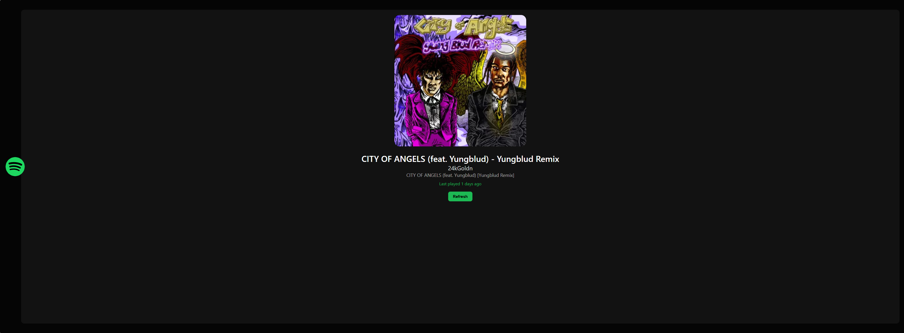

# Spotiweb

<div align="center">

 <!-- TODO: Add project logo and path if available, otherwise remove. -->

[](https://github.com/NoobVrGT/Spotiweb/stargazers)

[](https://github.com/NoobVrGT/Spotiweb/network)

[](https://github.com/NoobVrGT/Spotiweb/issues)

[](LICENSE) <!-- TODO: Add LICENSE file or specify license if known -->

**Your personal client-side Spotify player for an enhanced listening experience.**

[Live Demo](https://myspotiweb.netlify.app/) <!-- TODO: Add live demo link if hosted -->

</div>

## 📖 Overview

Spotiweb is a lightweight, client-side web application designed to be a personal Spotify player. Built with vanilla HTML, CSS, and JavaScript, it integrates directly with the Spotify Web API to offer a customized interface for managing and visualizing your Spotify listening habits. Without requiring a dedicated backend, Spotiweb provides features like displaying recent plays, user statistics, and an engaging audio visualizer, all within your browser.

## ✨ Features

-   **Seamless Spotify API Integration:** Connects directly with the Spotify Web API to fetch personalized user data and control playback.
-   **User Authentication via Spotify OAuth:** Securely authenticate with your Spotify account to access private listening data.
-   **Dynamic Recent Plays Display:** View your most recently played tracks in an intuitive interface.
-   **Personalized Listening Statistics:** Explore insights into your listening habits, such as top artists and tracks.
-   **Real-time Audio Visualizer:** Experience an interactive visual representation of the currently playing audio.
-   **Client-side Navigation:** Navigate effortlessly between different sections of the application (Home, Recent, Stats, Visualizer).
-   **Customizable User Interface:** Enjoy a unique visual experience powered by custom CSS.

## 🖥️ Screenshots

 <!-- TODO: Add actual screenshots of the application -->
_Homepage showing basic player functionality._

!

## 🛠️ Tech Stack

**Frontend:**


**APIs:**


## 🚀 Quick Start

This project is a static web application that runs entirely in your browser.

### Prerequisites
-   A modern web browser (e.g., Chrome, Firefox, Edge).
-   A **Spotify Developer Account** to obtain a Client ID for accessing the Spotify Web API.
    -   Register your application at the [Spotify Developer Dashboard](https://developer.spotify.com/dashboard/).
    -   Add `http://localhost:[PORT]/index.html` (or your deployment URL) to the Redirect URIs in your application settings.

### Installation

1.  **Clone the repository**
    ```bash
    git clone https://github.com/NoobVrGT/Spotiweb.git
    cd Spotiweb
    ```

2.  **Environment setup**
    This application requires your Spotify Client ID to interact with the Spotify API.
    Locate the `main.js` file and find the variable `CLIENT_ID`. Replace the placeholder with your actual Spotify Client ID obtained from your developer dashboard.
    ```javascript
    // main.js
    const CLIENT_ID = "YOUR_SPOTIFY_CLIENT_ID"; // Replace with your actual Client ID
    ```
    _Note: For security reasons, never hardcode your Client Secret in client-side code._

3.  **Start development server**
    Since this is a static site, you can simply open `index.html` in your browser. However, due to browser security restrictions (CORS) when making API calls, it is recommended to serve the files using a simple local HTTP server.

    You can use Python's built-in server:
    ```bash
    # If you have Python 3
    python -m http.server 8888
    # If you have Python 2
    python -m SimpleHTTPServer 8888
    ```
    Or Node.js `serve` package:
    ```bash
    npm install -g serve
    serve .
    ```

4.  **Open your browser**
    Visit `http://localhost:8888` (or the port specified by your server).

## 📁 Project Structure

```
Spotiweb/
├── assets/             # Static assets like images, logos, etc.
├── index.html          # Main entry point and home page
├── main.js             # Core JavaScript logic and Spotify API interactions
├── recent.html         # Page displaying recently played tracks
├── stats.html          # Page for user listening statistics
├── style.css           # Global styling for the application
└── visualizer.html     # Page with an audio visualization feature
```

## ⚙️ Configuration

### Environment Variables
While not using a traditional `.env` file for a client-side app, your Spotify Client ID needs to be configured:

| Variable        | Description                              | Default | Required |

|-----------------|------------------------------------------|---------|----------|

| `CLIENT_ID`     | Your Spotify Application's Client ID.    | (None)  | Yes      |

| `REDIRECT_URI`  | The URI Spotify redirects to after auth. | `http://localhost:8888/index.html` | Yes      |

These are typically managed directly within `main.js` for this project's architecture.

## 🔧 Development

The development workflow involves directly editing the HTML, CSS, and JavaScript files. Changes are reflected by refreshing the browser after saving.

## 🚀 Deployment

This project can be deployed as a static website to any hosting service that supports static files (e.g., GitHub Pages, Vercel, Netlify, Amazon S3).

1.  **Update `REDIRECT_URI`**: Before deploying, ensure you update the `REDIRECT_URI` in `main.js` and in your Spotify Developer Dashboard to reflect your live domain.

2.  **Upload Files**: Simply upload all the files and folders (e.g., `index.html`, `main.js`, `style.css`, `assets/`, `recent.html`, `stats.html`, `visualizer.html`) to your static hosting provider.

## 🤝 Contributing

We welcome contributions! If you have suggestions or improvements, please feel free to:

1.  Fork the repository.
2.  Create a new branch (`git checkout -b feature/your-feature`).
3.  Make your changes.
4.  Commit your changes (`git commit -m 'Add new feature'`).
5.  Push to the branch (`git push origin feature/your-feature`).
6.  Open a Pull Request.

## 📄 License

This project is not currently licensed. Please contact the repository owner for licensing information.

## 🙏 Acknowledgments

-   **Spotify Web API** for providing the platform to build this application.

## 📞 Support & Contact

-   🐛 Issues: [GitHub Issues](https://github.com/NoobVrGT/Spotiweb/issues)

---

<div align="center">

**⭐ Star this repo if you find it helpful!**

Made with ❤️ by [NoobVrGT](https://github.com/NoobVrGT)

</div>

